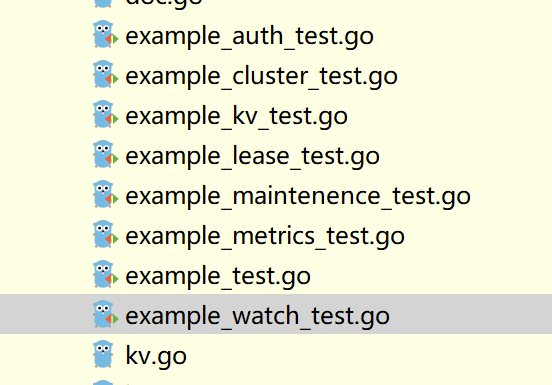

## Go Moudle

最主要的是配好GOProxy

[一文搞懂Go语言的最新依赖管理：go mod的使用｜ 青训营笔记 - 掘金](https://juejin.cn/post/7099070146329149477)

```
go get k8s.io/client-go@latest
```

出现红色依赖可以直接鼠标放上去选择Sync Dependencies

在k8s项目中这样vendor中会多出一些东西

## etcd

```
go get go.etcd.io/etcd/clientv3
```

首先需要运行一个etcd实例

这边选择使用docker镜像

下面演示在windows运行docker镜像+直接运行go程序来访问单机etcd的操作

```
docker run -d --name Etcd-server \
    --publish 2379:2379 \
    --publish 2380:2380 \
    --env ALLOW_NONE_AUTHENTICATION=yes \
    bitnami/etcd:latest

// windows里面我尝试\这个拼接命令无法识别，可以再cmd中使用^或者自己手动合成一行吧
docker run -d --name Etcd-server ^
  --publish 2379:2379 ^
  --publish 2380:2380 ^
  --env ALLOW_NONE_AUTHENTICATION=yes ^
  bitnami/etcd:latest
```

### 编译错误

注：可能不会发生？你们可以先go get go.etcd.io/etcd/clientv3，example出错再看后面的

```
注意看go.mod里面etcd的版本，如果是3.5.8的就没有问题
一开始我下载的是3.3.27的就会出错，但都是一条命令下载的，具体原因未知
可以直接用我的go.mod
```


https://github.com/etcd-io/etcd/issues/11931

---

i have resolve it.  

1、first: open the go.mod, add this line :  

replace ( google.golang.org/grpc => google.golang.org/grpc v1.26.0)  

2、then:  

go get -u -v go.etcd.io/etcd

---

上面那个不一定行，可以再试试：

`go get google.golang.org/grpc@v1.26.0`

然后就能编译通过了

```
注意可能有潜在的问题
https://github.com/etcd-io/etcd/issues/11931
这里面有人提到：
Be careful - grpc >= v1.26.0, <1.27.1 has a nasty bug where temporary failure of DNS resolution will bring your client down until it is restarted. See grpc/grpc-go#3353
```

但是这个etcd最后的commit在2020年，后面看issue貌似也没有修复

### 使用总结

关于go调用的实例官方文档基本没有资料

Ctrl+鼠标点击import中的内容



（注：上面的是我3.3.27中的，3.5.8貌似没有这些名叫example的，但核心还是直接看源码的接口，或者看里面的一些test文件中的用法）

看这些example中的使用方法，不编译错误基本没有问题

注意docker中etcd开启了，不然会一直尝试重连然后spin


我在cmd/example/etcd/etcd-example.go里面放了一些KV、watch相关的示例

经典的方法都是创建一个timeout的context，在get等方法中传进去，执行完后使用cancel取消这个context，重点关注Txn这个事务操作

> 在 etcd 中，`Txn` 表示事务操作。一个 `Txn` 包含多个操作（`Op`），只有当所有操作都成功执行后，整个事务才会被提交。如果有任何一个操作失败，整个事务都会被回滚。
> 
> 使用 `Txn` 可以确保多个操作的原子性，因为这些操作都是在同一事务中执行的。这可以避免出现在执行单个操作时可能出现的竞态条件和并发冲突。
> 
> 使用 `Txn` 时，需要按顺序添加多个操作，而每个操作都必须指定一个键和一个值。可以使用 `If` 方法设置一个条件，只有当这个条件满足时，对应的操作才会被执行。也可以使用 `Else` 方法指定一个操作，当上一个操作的条件不满足时，将执行这个操作。
> 
> 事务的提交和回滚是自动处理的，只需在所有操作添加完毕后调用 `Commit` 方法即可提交事务，而在任何操作出错时都会自动回滚事务。

查看所有的数据：在docker终端输入`etcdctl get "" --prefix`，意思是找出所有前缀为""的key和value，两行一组

另外的一些参考：[go操作etcd | 李文周的博客](https://www.liwenzhou.com/posts/Go/etcd/)
